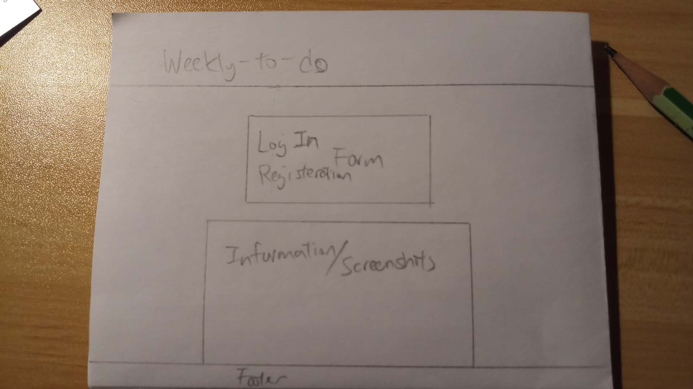
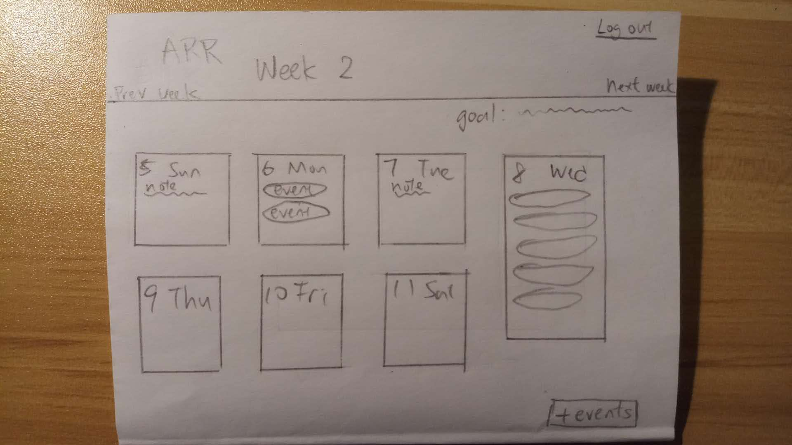
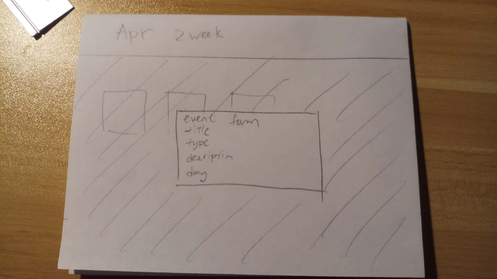

# weekly-to-do-react-client

## User Story
- user can register, log in and log out with username and password, and delete user account
- user can view the events in the current and the following weeks and all of the previous weeks since the account creation
- user can update weekly goals to the current week and the following week
- user can add notes to each days in a week
- user can add, update, and delete events to the current week and the following week
- user can view the description of the events by clicking on the event title

## Wireframe
### Login and Registeration form

### Week View

### New Event form

